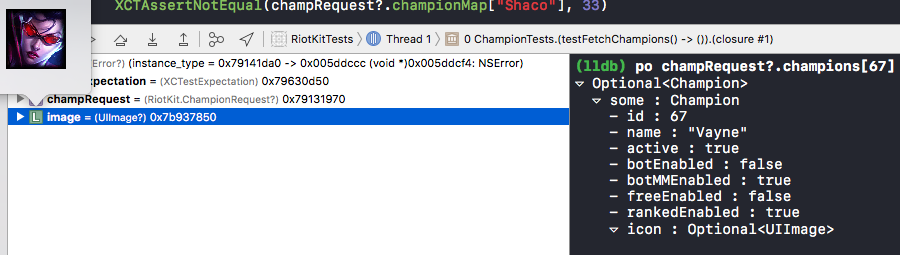

# RiotKit

[](https://travis-ci.org/RiotKit/RiotKit)
[](https://codecov.io/gh/RiotKit/RiotKit/branch/master)
[](https://github.com/RiotKit/RiotKit/blob/master/LICENSE)
[](https://badge.fury.io/gh/RiotKit%2FRiotKit)
[](http://twitter.com/Hexploitable)

RiotKit is a Swift framework written to serve as a wrapper around the Riot Games API.
The API provides access into many of the League of Legends stats/game information including player details and match history.


For example, champion data is now pulled, and populated into an array of [Champion](RiotKit/RiotKit/Champion.swift) structs:-




```
(lldb) po champRequest?.champions[67]
▿ Optional<Champion>
  ▿ some : Champion
    - id : 67
    - name : "Vayne"
    - active : true
    - botEnabled : false
    - botMMEnabled : true
    - freeEnabled : false
    - rankedEnabled : true
    ▿ icon : Optional<UIImage>
```

## Attribution
```
RiotKit isn't endorsed by Riot Games and doesn't reflect the views or opinions of Riot Games or anyone officially involved in producing or managing League of Legends. League of Legends and Riot Games are trademarks or registered trademarks of Riot Games, Inc. League of Legends © Riot Games, Inc.
```
